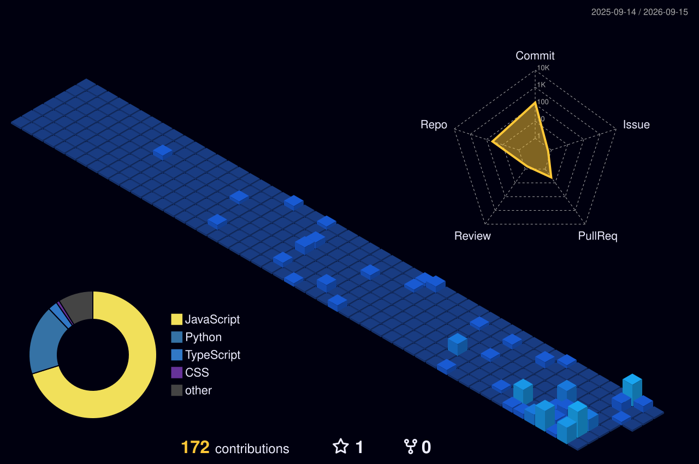

<!-- Animated Header Banner -->

<h3>✨ <b>Full-Stack Developer & AI/ML Builder</b> ✨</h3>

<i>Building AI-powered tools that solve real, everyday problems — from resumes to interviews to academics.</i>

 

<!-- Navigation Badges -->

 

---

### 🧠 About Me

<table border="0" width="100%">
  <tr>
    <td style="background-color: #0d1117; border: 1px solid #30363d; border-radius: 10px; padding: 18px;">
      

        I am a <b>Full-Stack Developer</b> and <b>AI/ML Builder</b> who loves turning complex ideas into practical, high-impact products — software that users actually rely on, from ATS-friendly resumes to real-time interview prep systems.
      

      

        Currently, I am deep into <code>Large Language Models (LLMs)</code>, <code>Agentic AI Architecture</code>, and automating complex workflows using tools like <code>n8n</code> and <code>Make.com</code>. Beyond building AI demos, my core focus is shipping production-ready systems backed by robust backend services and cloud-native DevOps pipelines (<code>Docker</code>, <code>Kubernetes</code>, <code>AWS</code>, <code>CI/CD</code>).
      

      

        I work across <code>React</code>, <code>Vite</code>, <code>Node.js</code>, <code>Express</code>, <code>MongoDB</code>, and <code>C++</code>, while continuously expanding into cloud-native deployments and scalable AI architectures.
      

    </td>
  </tr>
</table>

 

---

### 🚀 Featured Projects

<table width="100%">
  <tr>
    <td width="50%" valign="top" style="background-color: #0d1117; border: 1px solid #30363d; border-radius: 8px; padding: 12px;">
      <h4>📄 AI-Powered Resume Builder Platform</h4>
      
<i>Four AI agents, one job — a resume that actually gets past ATS filters.</i>

      
A multi-agent system where specialized AI agents collaborate to write, optimize, and score resumes in real-time with a 10-metric ATS analysis engine.

      

        
        
        
      

      <a href="#"><b>🔗 Live Demo</b></a> | <a href="#"><b>💻 Repository</b></a>
    </td>
    <td width="50%" valign="top" style="background-color: #0d1117; border: 1px solid #30363d; border-radius: 8px; padding: 12px;">
      <h4>❓ AI Doubt Solver</h4>
      
<i>Ask anything — grounded answers powered by vector search.</i>

      
A real-time Q&A assistant built on a RAG pipeline. Content is retrieved via MongoDB Atlas Vector Search and processed by Gemini AI for accurate results.

      

        
        
        
      

      <a href="#"><b>💻 Repository</b></a>
    </td>
  </tr>
  <tr>
    <td width="50%" valign="top" style="background-color: #0d1117; border: 1px solid #30363d; border-radius: 8px; padding: 12px;">
      <h4>📝 AI-Powered Form Generator</h4>
      
<i>Describe the form; receive conditional logic & analytics.</i>

      
Transforms plain-language prompts into dynamic forms complete with conditional show/hide logic and a full response analytics dashboard.

      

        
        
        
      

      <a href="#"><b>🔗 Live Demo</b></a> | <a href="#"><b>💻 Repository</b></a>
    </td>
    <td width="50%" valign="top" style="background-color: #0d1117; border: 1px solid #30363d; border-radius: 8px; padding: 12px;">
      <h4>🎙️ AI Mock Interview Platform</h4>
      
<i>Simulate high-stakes interviews before they count.</i>

      
Simulates real interview scenarios and delivers structured feedback on technical depth and communication skills to eliminate prep gaps.

      

        
        
        
      

      <a href="#"><b>💻 Repository</b></a>
    </td>
  </tr>
</table>

 

---

### 🛠️ Tech Stack & Capabilities

<table width="100%">
  <tr>
    <td width="50%" valign="top" style="background-color: #0d1117; border: 1px solid #30363d; border-radius: 8px; padding: 12px;">
      <h4>🤖 Generative AI, LLMs & RAG</h4>
      

        
        
        
        
        
      

    </td>
    <td width="50%" valign="top" style="background-color: #0d1117; border: 1px solid #30363d; border-radius: 8px; padding: 12px;">
      <h4>⚙️ Agentic AI & Automation Workflows</h4>
      

        
        
        
        
      

    </td>
  </tr>
  <tr>
    <td width="50%" valign="top" style="background-color: #0d1117; border: 1px solid #30363d; border-radius: 8px; padding: 12px;">
      <h4>💻 Languages & Frontend</h4>
      

        
        
        
        
        
        
      

    </td>
    <td width="50%" valign="top" style="background-color: #0d1117; border: 1px solid #30363d; border-radius: 8px; padding: 12px;">
      <h4>⚙️ Backend, DevOps & Database</h4>
      

        
        
        
        
        
      

    </td>
  </tr>
</table>
---
### 📊 GitHub Activity & Analytics

  

<table width="100%">
  <tr>
    <td align="center" style="background-color: #0d1117; border: 1px solid #30363d; border-radius: 10px; padding: 15px;">
      <h4>🌐 3D Contribution Map</h4>
       
      
    </td>
  </tr>
</table>

